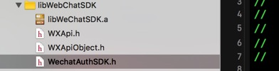
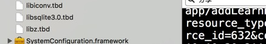
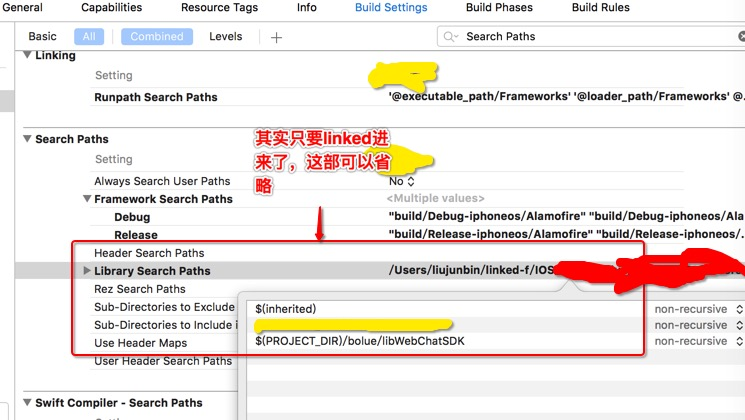
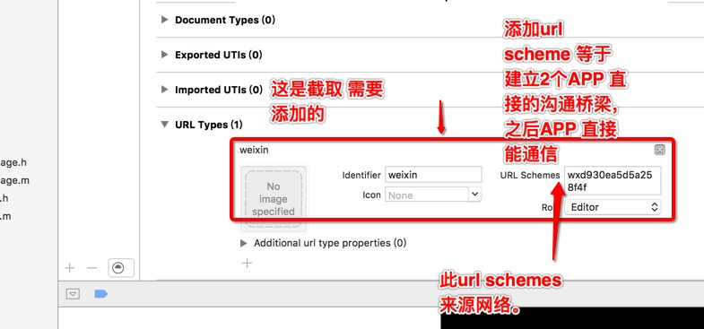
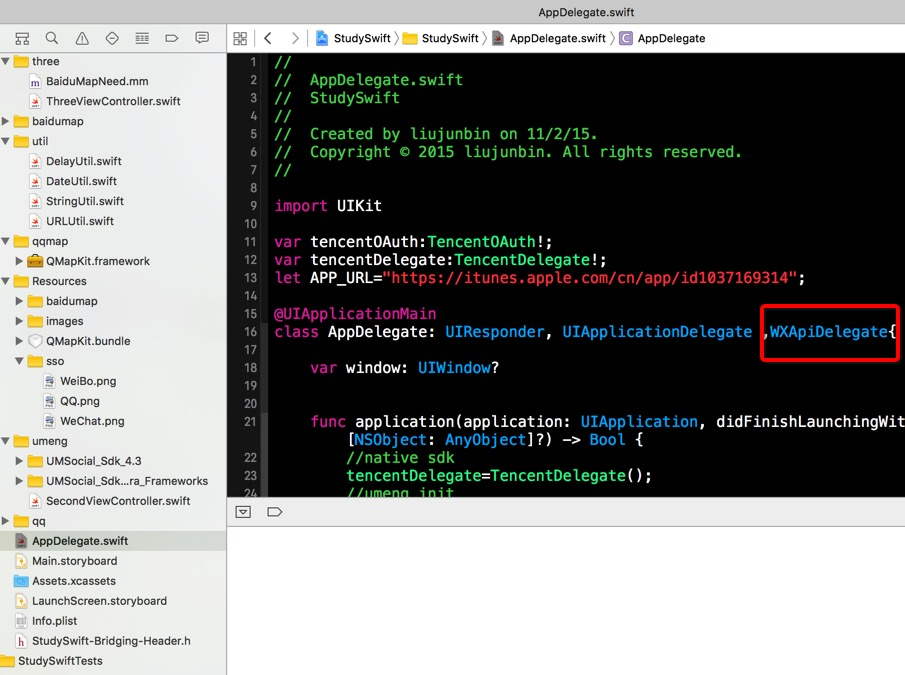
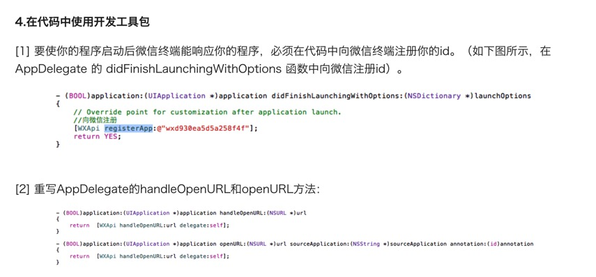
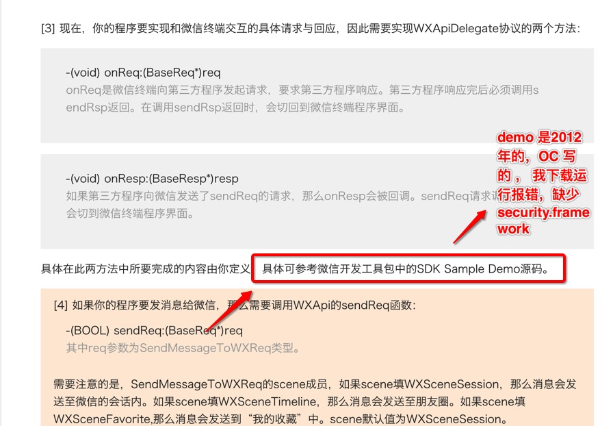

# iOS 微信第三方登陆和分享、收藏


### 准备工作

  ```
  1.请到 开发者应用登记页面 进行登记，登记并选择移动应用进行设置后，将获得AppID 和 AppSecret 
  2.SDK文件包括 libWeChatSDK.a，WXApi.h，WXApiObject.h , WechatAuthSDK.h 四个
    
    文件下载见文件内部（微信官网下载最佳）
  
  ```

### 环境搭建

  ```
  1.在XCode中建立你的工程
  2.SDK文件包括 libWeChatSDK.a，WXApi.h，WXApiObject.h , WechatAuthSDK.h 四个
    
  3.由于微信开放平台新增了微信模块用户统计功能，开发者需要在工程中链接上:SystemConfiguration.framework,libz.tbd,libsqlite3.0.tbd,libc++.tbd。
  4.在你的工程文件中选择Build Setting，在Search Paths中添加 libWeChatSDK.a ，WXApi.h，WechatAuthSDK.h 四个文件所在位置
  5.在Xcode中，选择你的工程设置项，选中“TARGETS”一栏，在“info”标签栏的“URL type“添加“URL scheme”为你所注册的应用程序id,当然也能添加weibo qq 之类的，同理
  6. 并增加 WXApiDelegate 协议
  ```











### 目前关注


 ```

react  https://github.com/facebook/react
ionic https://github.com/driftyco/ionic
中国首个开源 HTML5 跨屏前端框架 http://amazeui.org/

 ```


